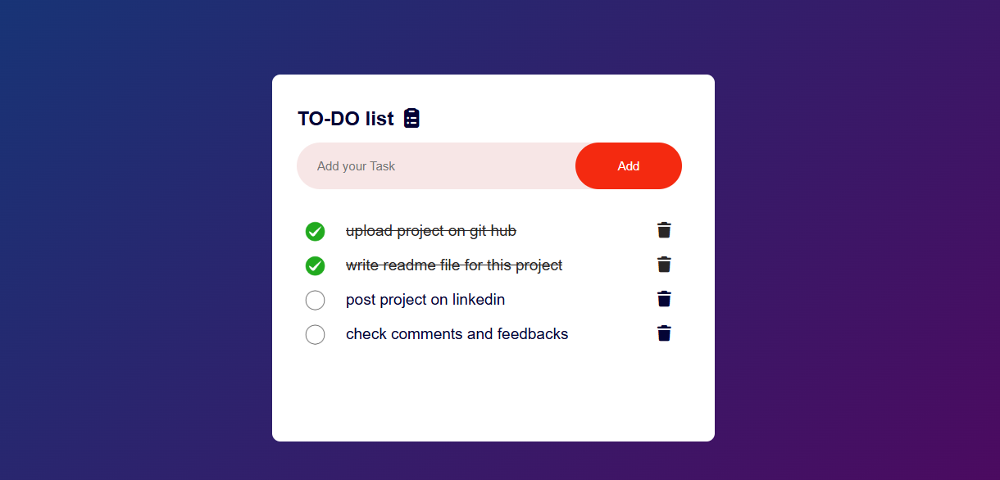

  📝 Simple To-Do App
Ek basic To-Do list app, jo aapko tasks ko organize karne mein madad karti hai. Is app ko HTML, CSS, aur JavaScript ka use karke banaya gaya hai, aur yeh Local Storage mein data save karta hai.

  ✨ Features
Add & Delete Tasks: Naye tasks add karein aur poore hue tasks ko delete karein.

Mark as Done: Tasks ko complete mark karne ke liye un par click karein.

Data Saving: Aapke tasks browser mein save ho jaate hain.

  🚀 How to Use
Repository clone karein.

index.html file open karein.

